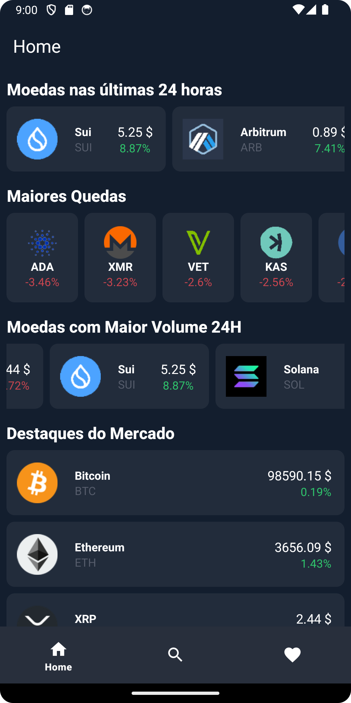
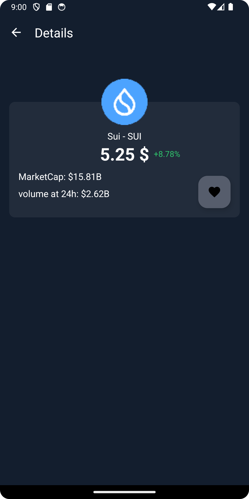
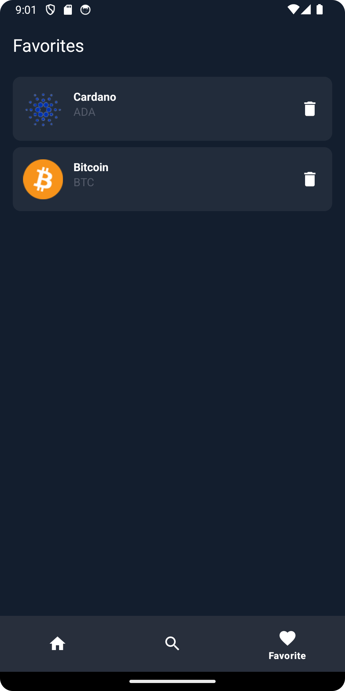
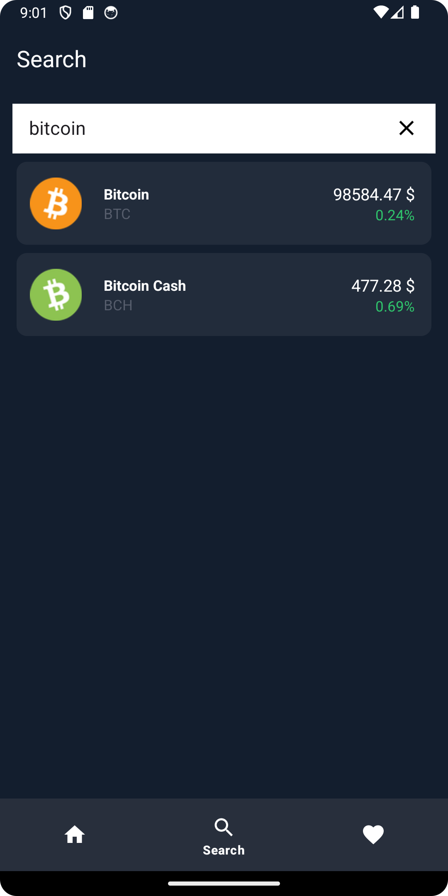

# 🚀 CryptoApp

## 📖 Resumo do Projeto

O **CryptoApp** é um aplicativo simples e funcional para rastrear informações de criptomoedas. Ele oferece recursos como exibição de preços, detalhes, busca eficiente e gerenciamento de favoritos. Com uma arquitetura bem definida e tecnologias modernas, o app entrega uma experiência fluida para os usuários.

---

## 🚀 Funcionalidades

- **Lista de Criptomoedas**: Exibe uma lista com informações atualizadas sobre as principais criptomoedas.
- **Tela de Detalhes**: Informações detalhadas sobre uma criptomoeda específica.
- **Busca Inteligente**: Pesquise criptomoedas rapidamente pelo nome ou símbolo.
- **Favoritos**: Adicione ou remova moedas da sua lista de favoritos.
- **Navegação Simplificada**: Navegação eficiente entre telas utilizando o Navigation Component.

---

## 🛠️ Tecnologias Utilizadas

### 📱 **Desenvolvimento do App**
- **Kotlin**: Linguagem de programação principal.
- **Arquitetura MVVM + Clean Architecture**: Estrutura bem organizada e modular.
- **Room**: Banco de dados local para gerenciamento de favoritos.
- **Retrofit**: Comunicação com APIs RESTful.
- **Glide**: Carregamento de imagens das criptomoedas.
- **Koin**: Injeção de dependências leve e eficiente.
- **Jetpack Navigation**: Navegação entre Activity e Fragments.

### 🌐 **Comunicação com API**
- **CoinMarketCap API**: Consumo de dados em tempo real sobre criptomoedas.
- **Interceptor**: Adiciona cabeçalhos necessários para autenticação na API.

---

## 📷 Screenshots

|  |  |  |
|:-------------------------------------------------------------:|:-------------------------------------------------------------------:|:------------------------------------------------------------:|
| **Tela Home**                                             | **Tela de Detalhes**                                               | **Tela de Favoritos**                                            |
|  |                                                                     |                                                                     |
| **Tela de Busca**                                          |                                                                     |                                                                     |

## 📂 Estrutura do Projeto

```plaintext
📂 crypto_app
 ┣ 📂 data
 ┃ ┣ 📂 local
 ┃ ┃ ┣ 📂 repository         # Repositório local (Room)
 ┃ ┃ ┣ AppDataBase.kt        # Configuração do banco de dados local
 ┃ ┃ ┗ FavoriteCryptoDao.kt  # DAO para gerenciar favoritos
 ┃ ┣ 📂 remote
 ┃ ┃ ┣ 📂 api
 ┃ ┃ ┃ ┣ 📂 dto              # Objetos de transferência de dados (DTOs)
 ┃ ┃ ┃ ┣ 📂 interceptor      # Interceptores para requisições HTTP
 ┃ ┃ ┃ ┣ ApiService.kt       # Interface de chamadas à API
 ┃ ┃ ┃ ┗ Constants.kt        # Configurações e constantes da API
 ┃ ┃ ┗ 📂 repository         # Repositório para integração com API
 ┃ ┣ 📂 mapper               # Conversores de DTO para Domain
 ┃ ┗ 📂 util                 # Funções utilitárias e helpers
 ┣ 📂 di                     # Configuração de injeção de dependências (Koin)
 ┣ 📂 domain
 ┃ ┣ 📂 local
 ┃ ┃ ┣ 📂 model              # Modelos do banco de dados local
 ┃ ┃ ┣ 📂 repository         # Interfaces de repositórios locais
 ┃ ┃ ┗ 📂 usecases           # Casos de uso relacionados ao banco local
 ┃ ┗ 📂 remote
 ┃ ┃ ┣ 📂 model              # Modelos relacionados à API
 ┃ ┃ ┣ 📂 repository         # Interfaces de repositórios remotos
 ┃ ┃ ┗ 📂 usecases           # Casos de uso relacionados à API
 ┣ 📂 presentation
 ┃ ┣ 📂 ui
 ┃ ┃ ┣ 📂 adapter            # Adapters do RecyclerView
 ┃ ┃ ┣ 📂 details            # Tela de detalhes da criptomoeda
 ┃ ┃ ┣ 📂 main
 ┃ ┃ ┃ ┣ 📂 fragments
 ┃ ┃ ┃ ┃ ┣ 📂 base           # Classes base para reuso
 ┃ ┃ ┃ ┃ ┣ 📂 favorite       # Tela de favoritos
 ┃ ┃ ┃ ┃ ┣ 📂 home           # Tela principal com a lista de criptomoedas
 ┃ ┃ ┃ ┃ ┗ 📂 search         # Tela de busca
 ┃ ┃ ┃ ┗ MainActivity.kt     # Activity principal do app
 ┃ ┗ 📂 state                # Gerenciamento de estados
 ┗ 📂 util                   # Funções utilitárias para uso geral
```

## 🔧 Ferramentas de Compilação e Versões

- **Gradle**: `8.9`
- **Kotlin**: `1.9.24`
- **Min SDK**: `24`
- **Target SDK**: `34`

---


## 💡 Como Rodar o Projeto

1. **Clone o repositório**:
   ```bash
   git clone https://github.com/kaioLimaX/crypto_app.git
   ```

2. **Configure a API Key**:
   - Crie um arquivo `apikey.properties` na raiz do projeto:
     ```properties
     API_KEY=sua-chave-da-api-aqui
     ```

3. **Abra o projeto no Android Studio**.
4. **Compile e execute o projeto** em um dispositivo/emulador.

---

## 📜 Licença

Este projeto é para fins educacionais e demonstração de habilidades técnicas. 🚀
